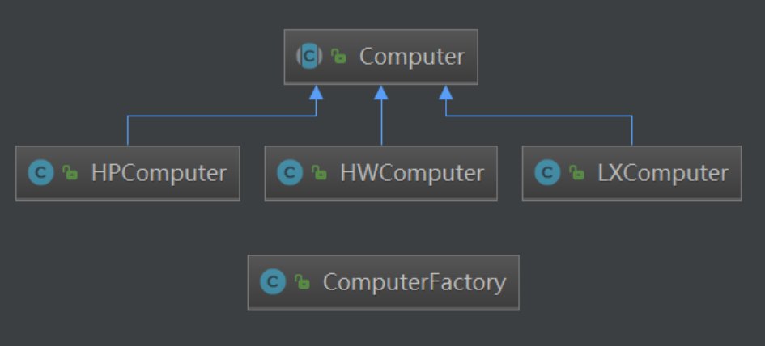
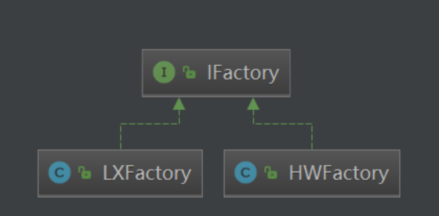

# 工厂模式

> 创建型模式，用于创建复杂对象，隐藏具体的创建逻辑

# 1.简单工厂

> 只有一个工厂，根据不同的参数，创建不同的对象



```java
public class ComputerFactory {
    public Computer newComputer(String name) {
        Computer computer = null;
        switch (name) {
            case "hw" : computer = new HWComputer(); break;
            case "lx" : computer = new LXComputer(); break;
            case "hp" : computer = new HPComputer(); break;
        }

        return computer;
    }
}
```

> 优点：简单
>
> 缺点：新增产品，就要修改工厂类，违反了`开闭原则`

# 2.工厂模式

> 每一种产品都有对应的工厂



```java
public interface IFactory {
    Computer newComputer();
}

public class HWFactory implements IFactory {
    @Override
    public Computer newComputer() {
        return new HWComputer();
    }
}

public class LXFactory implements IFactory {
    @Override
    public Computer newComputer() {
        return new LXComputer();
    }
}
```

> 优点：符合开闭原则和单一原则。扩展性高，如果想增加一个产品，只要扩展一个工厂类就可以
>
> 缺点：每次增加一个产品时，都需要增加一个工厂

# 3.真实源码

## 1.EventExecutorChooserFactory

> 背景介绍：
>
> ​	netty是基于reactor模型的，在boss接收连接后，需要给woker分发channel，那么分发给哪一个woker呢 ？此时就需要一个选择器，由选择器来决定选择哪一个woker，但是选择器可以有多种实现，于是就有了选择器工厂


下面这个代码涉及了: **简单工厂 + 工厂 + 单例**

> 从整体角度来看，这是一个工厂模式，符合开闭原则，新增一种选择器`EventExecutorChooser`的时候，只需要增加一个接口`EventExecutorChooserFactory`的实现类即可
>
> 单单从`DefaultEventExecutorChooserFactory`来看，这又是一种简单工厂模式，它会根据`executors`数组的长度不同，来返回不同的Chooser
>
> 这么做的目的是，Chooser从大体上分类是比如轮询，随机等。但是轮询又分为数组长度是不是2的幂，因为如果是2的幂可以通过`与运算`，否则需要`%(取余)运算`，所以从EventExecutorChooserFactory角度来看是工厂模式，具体的实现类`DefaultEventExecutorChooserFactory`又是一个简单工厂模式

```java
public interface EventExecutorChooserFactory {

    /**
     * Returns a new {@link EventExecutorChooser}.
     */
    EventExecutorChooser newChooser(EventExecutor[] executors);

    /**
     * Chooses the next {@link EventExecutor} to use.
     */
    interface EventExecutorChooser {

        /**
         * Returns the new {@link EventExecutor} to use.
         */
        EventExecutor next();
    }
}
```


```java
/**
 * Chooser用途：用简单轮询的方式，在给定数组中选择下一个 EventExecutor
 */
public final class DefaultEventExecutorChooserFactory implements EventExecutorChooserFactory {

    // 单例模式(饿汉式)
    public static final DefaultEventExecutorChooserFactory INSTANCE = new DefaultEventExecutorChooserFactory();

    // 把构造函数私有化
    private DefaultEventExecutorChooserFactory() { }

    // 根据executors数组长度是否是2的幂，来获取不同的Chooser，这就是简单工厂的体现
    @Override
    public EventExecutorChooser newChooser(EventExecutor[] executors) {
        if (isPowerOfTwo(executors.length)) {
            return new PowerOfTwoEventExecutorChooser(executors);
        } else {
            return new GenericEventExecutorChooser(executors);
        }
    }

    // 判断val是否是2的幂
    private static boolean isPowerOfTwo(int val) {
        /**
         * 位运算：按位取反末尾加1，再与原来的做&运算，就会得到最右边的1
         * 如果和原来的数相等，说明二进制形式只有一个1，即2的幂
         */
        return (val & -val) == val;
    }

    private static final class PowerOfTwoEventExecutorChooser implements EventExecutorChooser {
        private final AtomicInteger idx = new AtomicInteger();
        private final EventExecutor[] executors;

        PowerOfTwoEventExecutorChooser(EventExecutor[] executors) {
            this.executors = executors;
        }

        @Override
        public EventExecutor next() {
            return executors[idx.getAndIncrement() & executors.length - 1];
        }
    }

    private static final class GenericEventExecutorChooser implements EventExecutorChooser {
        private final AtomicInteger idx = new AtomicInteger();
        private final EventExecutor[] executors;

        GenericEventExecutorChooser(EventExecutor[] executors) {
            this.executors = executors;
        }

        @Override
        public EventExecutor next() {
            return executors[Math.abs(idx.getAndIncrement() % executors.length)];
        }
    }
}
```

## 2.ReflectiveChannelFactory

> 背景介绍
>
> ​	在netty启动的时候，会写这样下面这样一段代码。先介绍一下bootStrap, 它的作用就是把各个组件给组装起来，让我们更加快捷的启动程序，它分为两个阶段，第一个阶段就是简单赋值，第二个阶段就是bind方法的执行，当执行bind()时，才会真正去创建各个组件对象。
>
> ```java
> ServerBootstrap serverBootstrap = new ServerBootstrap();
> // 第一阶段
> serverBootstrap.group(bossGroup, workerGroup)
>     	// 注意这里
>         .channel(NioServerSocketChannel.class)
>         .handler(new LoggingHandler(LogLevel.INFO))
>         .childHandler(new ChannelInitializer<SocketChannel>() {
>             // 省略...
>         });
> // 第二阶段
> ChannelFuture future = serverBootstrap.bind(localAddress).sync();
> ```
>
> ​	`channel(NioServerSocketChannel.class)`，这里就用到了工厂类，传入的是Class对象；但是如果一个Channel创建的行为比较复杂，可以用下面这个方法，直接传一个工厂。
>
> ```java
> channelFactory(ChannelFactory<? extends C> channelFactory)
> ```
>
> ​	其实即使我们只是传了一个Class对象，bootStrap也会创建一个简单工厂。调用上面这个方法。
>
> ```java
> /**
>  * The {@link Class} which is used to create {@link Channel} instances from.
>  * You either use this or {@link #channelFactory(io.netty.channel.ChannelFactory)} if your
>  * {@link Channel} implementation has no no-args constructor.
>  */
> public B channel(Class<? extends C> channelClass) {
>     return channelFactory(new ReflectiveChannelFactory<C>(
>             ObjectUtil.checkNotNull(channelClass, "channelClass")
>     ));
> }
> ```


**简单工厂**

```java
/**
 * Creates a new {@link Channel}.
 */
public interface ChannelFactory<T extends Channel> {
    /**
     * Creates a new channel.
     */
    @Override
    T newChannel();
}
```

```java
/**
 * A {@link ChannelFactory} that instantiates a new {@link Channel} by invoking its default constructor reflectively.
 */
public class ReflectiveChannelFactory<T extends Channel> implements ChannelFactory<T> {

    private final Constructor<? extends T> constructor;

    public ReflectiveChannelFactory(Class<? extends T> clazz) {
        ObjectUtil.checkNotNull(clazz, "clazz");
        try {
            this.constructor = clazz.getConstructor();
        } catch (NoSuchMethodException e) {
            throw new IllegalArgumentException("Class " + StringUtil.simpleClassName(clazz) +
                    " does not have a public non-arg constructor", e);
        }
    }

    @Override
    public T newChannel() {
        try {
            return constructor.newInstance();
        } catch (Throwable t) {
            throw new ChannelException("Unable to create Channel from class " + constructor.getDeclaringClass(), t);
        }
    }

    @Override
    public String toString() {
        return StringUtil.simpleClassName(ReflectiveChannelFactory.class) +
                '(' + StringUtil.simpleClassName(constructor.getDeclaringClass()) + ".class)";
    }
}
```