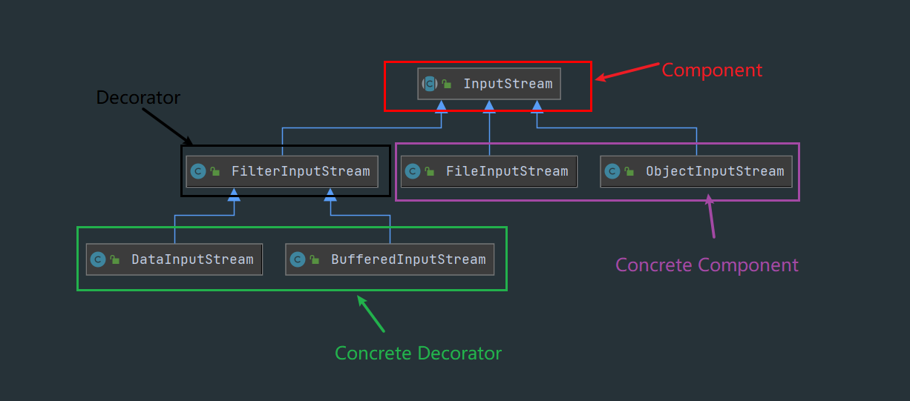

# 装饰者模式(Decorator)

# 1.简介

> ​	装饰者模式是继承的替代方案，在不创建更多的子类的情况下，将对象的功能加以扩展，而且可以通过多层装饰达到想要的对象，相比于继承，具有更多的灵活性

# 2.示例

> 1.业务接口

```java
public interface Component {
    void doSomething();
}
```

> 2.业务的实现类

```java
public class ConcreteComponent implements Component {

    @Override
    public void doSomething() {
        System.out.println("业务处理");
    }
}
```

> 3.装饰器的父类，这里可以设计成接口，抽象类或者普通类都行

```java
// 口诀：实现它，拥有它，调用它
public class Decorator implements Component {

    private Component component;

    public Decorator(Component component) {
        this.component = component;
    }

    @Override
    public void doSomething() {
        component.doSomething();
    }

}
```

> 4.具体装饰器

```java
public class ConcreteDecorator extends Decorator {

    public ConcreteDecorator1(Component component) {
        super(component);
    }

    @Override
    public void doSomething() {
        super.doSomething();
        this.doAnotherThing();
    }

    private void doAnotherThing() {
        System.out.println("打印日志");
    }
}
```

# 3.源码

## 1.jdk中的IO流



1.Component：通常是一个抽象类或者接口

```java
public abstract class InputStream {
    public abstract int read() throws IOException;
}
```

2.Concrete Component:  具体的业务实现类

```java
public class ObjectInputStream extends InputStream {...}
```

```java
public class FileInputStream extends InputStream {...}
```

3.Decorator: 装饰者的父类，也可以设计成抽象类或者接口，但是这里因为InputStream是一个类，所以这里并不可以设计成接口

```java
// 1. 继承或者实现Component
public class FilterInputStream extends InputStream {

    // 2. 组合 Component
    protected volatile InputStream in;

    protected FilterInputStream(InputStream in) {
        this.in = in;
    }


    // 3. 调用 Component
    public int read() throws IOException {
        return in.read();
    }
}
```

4.Concrete Decorator

```java
// 具体的装饰者
public class BufferedInputStream extends FilterInputStream {
    // 具有缓冲区
    public synchronized int read() throws IOException {
        if (pos >= count) {
            fill();
            if (pos >= count)
                return -1;
        }
        return getBufIfOpen()[pos++] & 0xff;
    }
}
```

```java
public class DataInputStream extends FilterInputStream {...}
```